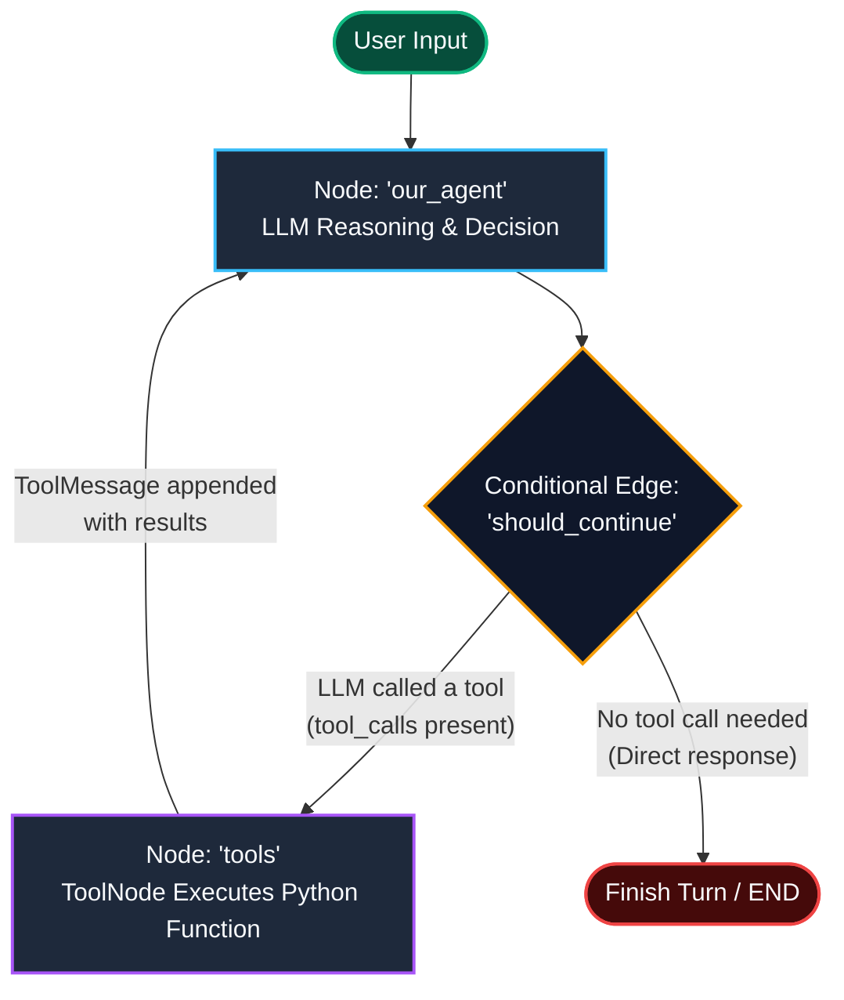

# 🐙 GitHub Issue Fetcher Agent

> A beginner-friendly, stateful **ReAct (Reason + Act)** AI agent built with **LangGraph**, **LangChain**, **ChatOllama (Llama 3.2)**, and the **GitHub REST API**.

---

## 📑 Table of Contents

- [Overview](#-overview)
- [Architecture & Graph Flow](#-architecture--graph-flow)
- [Core Concepts Explained](#-core-concepts-explained)
  - [1. Agent State & TypedDict](#1-agent-state--typeddict)
  - [2. LangGraph Reducers (`add_messages`)](#2-langgraph-reducers-add_messages)
  - [3. The BaseMessage Hierarchy](#3-the-basemessage-hierarchy)
  - [4. Tool Creation with `@tool`](#4-tool-creation-with-tool)
  - [5. Tool Binding (`bind_tools`)](#5-tool-binding-bind_tools)
  - [6. The ReAct Pattern & Routing](#6-the-react-pattern--routing)
  - [7. Conversational Memory (`MemorySaver`)](#7-conversational-memory-memorysaver)
  - [8. GitHub REST API Nuances](#8-github-rest-api-nuances)
- [File-by-File Breakdown](#-file-by-file-breakdown)
  - [`githubAPI.py`](#githubapipy)
  - [`main.py`](#mainpy)
- [Getting Started](#-getting-started)
  - [Prerequisites](#prerequisites)
  - [Installation & Setup](#installation--setup)
  - [Configuring Environment Variables](#configuring-environment-variables)
- [Running the Agent](#-running-the-agent)
- [Example Conversation](#-example-conversation)
- [Project Structure](#-project-structure)
- [Troubleshooting & Tips](#-troubleshooting--tips)

---

## 🌟 Overview

The **GitHub Issue Fetcher Agent** is an autonomous assistant capable of conversing naturally with developers, inspecting target GitHub repositories, and retrieving issues on demand. 

Instead of hardcoding search scripts or writing rigid rule-based bots, this project demonstrates the **Agentic AI** pattern:
- The user provides natural language queries (e.g., *"What issues are currently open?"* or *"Did someone assign any bugs to Alice?"*).
- An LLM (running locally via **Ollama**) reasons about the request and autonomously decides **which tool to invoke** and **what arguments to supply**.
- **LangGraph** orchestrates the execution cycle: passing state, executing tools, appending observations, and returning control to the LLM to summarize the final findings.
- An in-memory **checkpointer** ensures that the agent remembers previous conversational context across multiple turns.

---

## 🔄 Architecture & Graph Flow

The agent is organized as a stateful cyclic graph using **LangGraph**. The workflow follows the classic **ReAct** (Reasoning + Acting) loop:

### Mermaid Workflow Diagram



### ASCII Architecture Map

```text
                     ┌──────────────────┐
                     │    User Input    │
                     └────────┬─────────┘
                              │
                              ▼
                     ┌──────────────────┐
        ┌───────────►│    our_agent     │◄───────────┐
        │            │  (Ollama LLM)    │            │
        │            └────────┬─────────┘            │
        │                     │                      │
        │                     ▼                      │
        │              should_continue               │
        │                /          \                │
        │       (tool_calls)      (no tools)         │
        │              /              \              │
        │             ▼                ▼             │
        │      ┌─────────────┐     ┌───────┐         │
        │      │    tools    │     │  END  │         │
        │      │ (ToolNode)  │     └───────┘         │
        │      └──────┬──────┘                       │
        │             │                              │
        └─────────────┴──────────────────────────────┘
                    (Tool output returned as ToolMessage)
```

---

## 🧠 Core Concepts Explained

### 1. Agent State & `TypedDict`
In LangGraph, **State** is a shared data structure that flows between nodes. It acts as the agent's short-term memory during execution.
```python
class AgentState(TypedDict):
    messages: Annotated[Sequence[BaseMessage], add_messages]
```
- `TypedDict` provides type hints for the keys stored in the state dictionary.
- Every node receives the current state as input and returns a dictionary with state updates.

### 2. LangGraph Reducers (`add_messages`)
In standard Python dictionaries, updating a key overwrites its existing value:
```python
# Standard dictionary behavior:
state["messages"] = [new_message]  # ❌ Erases all past messages!
```
To build conversational memory, we use `Annotated[..., add_messages]`.
- `add_messages` is a **reducer function**.
- Whenever a node returns `{"messages": [new_message]}`, LangGraph **appends** the new message to the existing list rather than replacing it.
- If two messages share the same ID, `add_messages` updates the existing message in-place (**upsert**).

### 3. The BaseMessage Hierarchy
LangChain and LangGraph organize conversational data into four core message types:

| Message Type | Sender | Purpose |
| :--- | :--- | :--- |
| `HumanMessage` | User | Represents the prompt or instruction provided by the human user. |
| `AIMessage` | LLM | Represents the assistant's response. Can contain text content and/or structured `tool_calls`. |
| `SystemMessage` | Developer | Directives that define the agent's persona, boundaries, and task instructions. |
| `ToolMessage` | ToolNode | Contains the raw output of an executed tool, linked to the `AIMessage` by a `tool_call_id`. |

### 4. Tool Creation with `@tool`
The `@tool` decorator converts standard Python functions into schemas the LLM can understand:
```python
@tool
def get_all_repo_issues(state: str = "open") -> str:
    """Useful to get all issues from the repository. State can be 'open', 'closed', or 'all'."""
    ...
```
- **Docstrings Matter**: The LLM never sees your Python implementation code; it only sees the function name, the docstring, and argument type annotations. A clear, precise docstring is how the LLM decides *when* and *how* to use the tool.
- **Robust Error Handling**: Tools should catch exceptions and return an informative error message string rather than crashing. This allows the LLM to read the error and self-correct or report it clearly to the user.

### 5. Tool Binding (`bind_tools`)
```python
llm = ChatOllama(model="llama3.2", temperature=0.3).bind_tools(tools)
```
- `.bind_tools(tools)` serializes our Python functions into standard JSON tool-calling schemas (compatible with OpenAI and Ollama function calling).
- When the LLM decides an action is required, it returns an `AIMessage` containing a structured `tool_calls` list with arguments rather than plain text.
- Setting `temperature=0.3` minimizes hallucinations and makes tool argument generation consistent and predictable.

### 6. The ReAct Pattern & Routing
The **ReAct** (Reason + Act) design pattern allows an agent to solve problems step-by-step:
1. **Reason**: The LLM analyzes the user prompt and previous messages.
2. **Act**: If external data is needed, the LLM emits a tool call.
3. **Observe**: The graph executes the tool via `ToolNode` and injects the output into the state as a `ToolMessage`.
4. **Synthesize**: The graph returns to the LLM node so it can read the tool output and craft a human-friendly final answer.

The router function `should_continue` inspects `state["messages"][-1]`:
```python
def should_continue(state: AgentState) -> str:
    last_message = state["messages"][-1]
    if hasattr(last_message, "tool_calls") and last_message.tool_calls:
        return "tools"
    return END
```

### 7. Conversational Memory (`MemorySaver`)
By default, compiling a graph produces a stateless runner. To support multi-turn dialogues where the agent remembers what was said earlier, we attach a **checkpointer**:
```python
checkpointer = MemorySaver()
app = graph.compile(checkpointer=checkpointer)
```
- Every chat turn uses a session identifier: `thread_config = {"configurable": {"thread_id": "session_1"}}`.
- LangGraph automatically saves state snapshots per `thread_id`, enabling seamless follow-up questions like:
  - *User:* "List open issues."
  - *Agent:* "Found 3 issues: #1, #2, #3."
  - *User:* "Which one was created first?" *(Agent remembers the previous list!)*

### 8. GitHub REST API Nuances
Interacting with GitHub's REST API involves several key details:
- **Custom Media Type (`Accept: application/vnd.github+json`)**: Informs GitHub to use their standardized JSON response formatting.
- **API Versioning (`X-GitHub-Api-Version: 2022-11-28`)**: Locks the API version so future changes on GitHub's end won't break your agent.
- **Rate Limits**:
  - Unauthenticated requests: **60 requests/hour**.
  - Authenticated requests (with a Personal Access Token): **5,000 requests/hour**.
- **Pagination**: The GitHub API returns a maximum of 100 records per request. We iterate through `page += 1` until the API returns an empty list.
- **Issues vs. Pull Requests**: GitHub models Pull Requests as issues internally. Therefore, `GET /issues` returns both! To filter out PRs, we verify `if "pull_request" not in item`.

---

## 📂 File-by-File Breakdown

### `githubAPI.py`
Contains the raw HTTP client methods to query GitHub:
- `BASE_HEADERS`: Dictionary configuring authorization, API versioning, and media types.
- `fetch_all_issues(owner, repo, state)`: Paginates through all repository issues, ignores pull requests, and returns structured dictionaries.
- `fetch_issues_assigned_to_user(username, owner, repo, state)`: Queries GitHub using the `assignee` query parameter to filter by user.

### `main.py`
The agent's primary orchestrator:
- Defines `AgentState` with message memory.
- Wraps GitHub API calls into LangChain `@tool` definitions (`get_all_repo_issues`, `get_issues_assigned_to_user`).
- Initializes `ChatOllama` with `llama3.2` and binds the tools.
- Defines node functions (`model_call`) and conditional routing (`should_continue`).
- Assembles and compiles the LangGraph state graph with `MemorySaver`.
- Provides an interactive CLI chat loop (`run_chat_loop`) with multi-turn memory.

---

## 🚀 Getting Started

### Prerequisites
1. **Python 3.10+** installed on your system.
2. **Ollama** installed and running. Download from [ollama.com](https://ollama.com).
3. Pull the `llama3.2` model:
   ```bash
   ollama pull llama3.2
   ```
4. A **GitHub Personal Access Token (PAT)**:
   - Generate one at [github.com/settings/tokens](https://github.com/settings/tokens).
   - A Classic token with `repo` scope (or fine-grained token with Issues Read access) is sufficient.

### Installation & Setup

1. **Clone the repository:**
   ```bash
   git clone <your-repo-url>
   cd Simple-Github-Issue-fetcher-Agent
   ```

2. **Create and activate a virtual environment:**
   ```bash
   python3 -m venv env
   source env/bin/activate    # On Windows: env\Scripts\activate
   ```

3. **Install the required packages:**
   ```bash
   pip install -r requirements.txt
   ```

### Configuring Environment Variables

Copy the `.env.example` file to create your own `.env`:
```bash
cp .env.example .env
```

Open `.env` and fill in your details:
```env
OWNER="your_github_username_or_org"
REPO="your_repository_name"
GITHUB_TOKEN="ghp_yourPersonalAccessTokenHere"
```

> 🔒 **Security Notice**: `.env` is listed in `.gitignore` to prevent secret keys from ever being committed to source control. Never commit real tokens to GitHub!

---

## 💬 Running the Agent

Start the interactive terminal session:
```bash
python main.py
```

You will be greeted with the agent banner:
```text
=================================================================
🐙 GitHub Issue Fetcher Agent (LangGraph + Ollama)
=================================================================
Target Repository : your-username/your-repo
Commands          : Type 'exit', 'quit', or 'q' to end the chat.
=================================================================

You: 
```

---

## 🗣️ Example Conversation

```text
You: Hi, can you check if there are any open issues in the repository?

[Agent Thinking...]
⚙️  Calling Tool: get_all_repo_issues({'state': 'open'})
✅ Tool execution completed. Summarizing results...

Agent: There are currently 2 open issues in your repository:
1. #12 - Fix authentication token timeout (Author: dev_john, Assignees: [dev_john])
2. #15 - Update landing page responsive typography (Author: designer_sara, Assignees: None)

You: Are any of these assigned to dev_john?

[Agent Thinking...]
Agent: Yes! Issue #12 ("Fix authentication token timeout") is currently assigned to dev_john.

You: quit

👋 Goodbye! Thank you for using GitHub Issue Fetcher Agent.
```

---

## 📁 Project Structure

```text
Simple-Github-Issue-fetcher-Agent/
│
├── .env                  # Private environment variables (Git-ignored)
├── .env.example          # Sample environment template
├── .gitignore            # Git rules ignoring credentials, cache, and bytecode
├── githubAPI.py          # GitHub REST API interaction module
├── main.py               # LangGraph agent definitions & interactive CLI loop
├── requirements.txt      # Project dependencies
└── README.md             # Project documentation and conceptual guide
```

---

## 💡 Troubleshooting & Tips

- **Ollama connection errors (`ConnectionRefusedError`)**:
  Ensure Ollama is running in the background. You can start it by running `ollama serve` in a terminal or launching the Ollama desktop app.
- **GitHub 401 Unauthorized**:
  Double-check that your `GITHUB_TOKEN` in `.env` is valid and hasn't expired.
- **GitHub 404 Not Found**:
  Verify that the `OWNER` and `REPO` names are spelled correctly and that your token has access to private repositories if the target repo is private.
- **Rate Limit Warnings (HTTP 403)**:
  Ensure your `GITHUB_TOKEN` is loaded properly in `BASE_HEADERS`. Unauthenticated requests will hit the 60 req/hr ceiling quickly.
